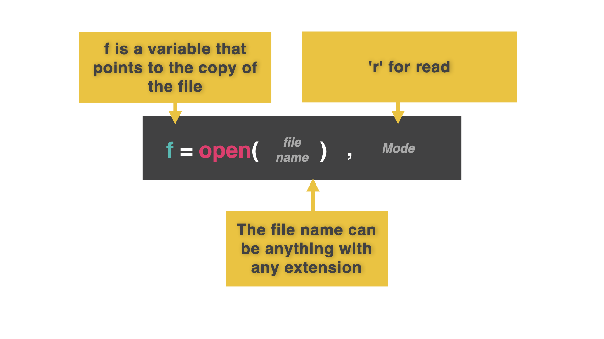
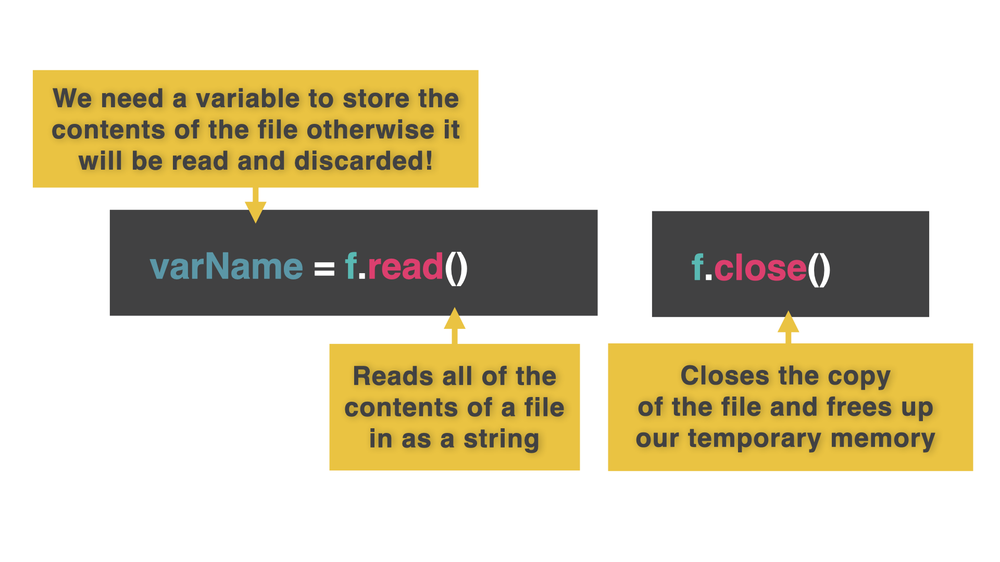
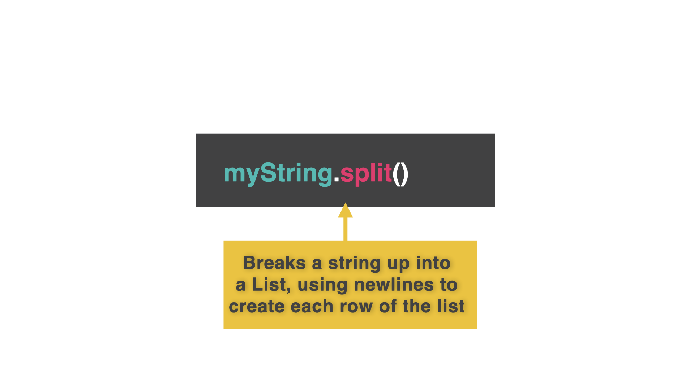

# Reading From a File

Once we've got data into a file, wouldn't it be just splendid to load it back into our program to use again?


Yes. Yes is the answer you're looking for.  


## Open

👉 The code to load from a file is pretty similar to that for writing.  The command is `open` instead of `read`, and the permissions are slightly different.


```python
f = open("filenames.list", "r")
```

## Read and Close

👉 In this example, the permission 'r' means 'read only'. Now we load the contents of the file into a variable using the `read` function. Next, close the file to free up the RAM used to store it.
```python
f = open("filenames.list", "r")
contents = f.read()
f.close()
```


## Print

👉 Finally output the contents of the 'contents' variable to test that it worked.

```python
f = open("filenames.list", "r")
contents = f.read()
f.close()

print(contents)
```
## Split

 Bringing everything in in one go is fine, but it would be much more useful to have it as separate items so we can examine it more easily.

👉 To do this, use the `.split()` function in the second to last line. This splits the string into a list of individual elements.

```python
f = open("filenames.list", "r")
contents = f.read()
f.close()

contents = contents.split() #added split here

print(contents)
```

### Try it out and load away!