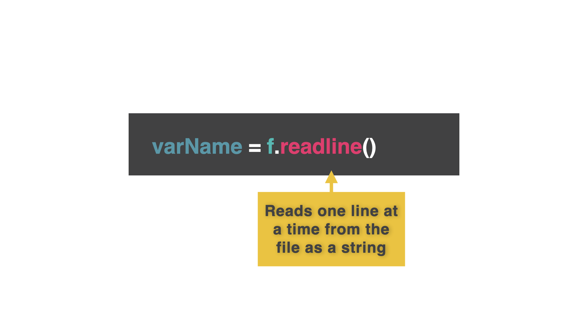

# One At A Time

## Form an orderly queue

Reading all the data at once is fine, reading one item at a time works slightly differently.

It uses the `.readline()` function.  

👉 The code below reads one line from the file.

```python
f = open("filenames.list","r")
contents = f.readline()
print(contents)

f.close()
```


## Repeat
To read more than one line, we repeat the command. 

👉 The `strip()` function removes the default new line from each print, which would cause an empty line between each line from the file.

```python
f = open("filenames.list","r")
contents = f.readline().strip()
print(contents)
contents = f.readline().strip()
print(contents)
contents = f.readline().strip()
print(contents)
contents = f.readline().strip()
print(contents)

f.close()
```
## Just Use a Loop!
👉 If you're screaming '**LOOP! USE A FREAKING LOOP, MAN!**' at the screen right about now.

Your wish is my command.


```python
f = open("filenames.list","r")
while True:
  contents = f.readline().strip()
  
  if contents == "":
    break
  #The last line in the file will be a blank
  #We break the loop if the line read is a blank

  print(contents)
  # Moved the print after the break so it won't output the final blank line.

f.close()


```

